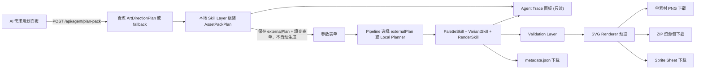
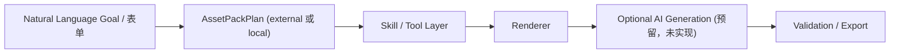
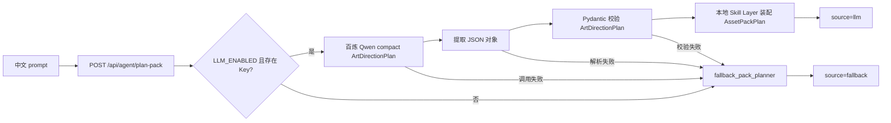

# 架构说明

## 文档状态

本文档描述当前百炼 LLM Art Director 兼容路径与后端 Tool Registry / Skill Registry 架构。产品需求以 `SPEC.md` v1.0 为准；LLM 仅生成轻量 `ArtDirectionPlan`，本地 Skill Layer 装配完整素材包，本地 Renderer 与无 Key fallback 仍是稳定主链路。

## 技术结构

| 模块 | 技术 | 当前职责 |
| --- | --- | --- |
| `apps/web` | React + TypeScript + Vite | Art Planner 面板、external plan 接入、本地 SVG 预览及全部本地导出 |
| `apps/api` | Python + FastAPI + Pydantic + OpenAI SDK | 提供健康检查、规划接口及应用侧本地 Tool Registry |
| `packages/renderer` | 预留 | 当前未承载实现，渲染逻辑位于前端 |
| `packages/schema` | 预留 | 当前未拆分为公共包 |
| `examples` | 预留 | 当前未提供静态示例资产 |

## 当前前端流程



1. 用户可以输入中文需求，由前端调用后端 `/api/agent/plan-pack` 获得完整 `AssetPackPlan`；配置百炼时模型只返回紧凑 `ArtDirectionPlan`，由后端本地展开后标记来源为 `llm`，否则为 `fallback`。
2. 前端从计划中的素材类型填入表单并保存 `externalPlan`；用户仍需点击生成。若用户手动修改参数，外部计划失效并回到本地 Planner。
3. 用户手动点击生成后，`buildAssetPack` 优先消费匹配当前表单的 `externalPlan`；没有外部计划时继续调用本地 Planner Agent。
4. 素材基础字段保持 `id`、`type`、`theme`、`style`、`size`、`seed`，并扩展 `name`、`description`、`variant`、`palette` 与 `renderHints`。
5. Validation Layer 返回中文 warning 而不阻塞渲染；SVG Renderer 优先消费色板和渲染提示，使同类型 variant 可见不同。其中 `renderHints.glow` 保持 boolean，`renderHints.glowColor` 表达发光颜色并优先用于高光轮廓。
6. 单素材 PNG 下载将当前 SVG 栅格化为所选尺寸的 PNG。
7. Metadata 下载将本次请求和素材列表导出为 JSON，并保留 `name`、`variant`、`description` 与 `renderHints`。
8. ZIP 下载复用 PNG 栅格化结果，打包全部素材与 `metadata.json`。
9. Sprite Sheet 下载按页面素材顺序将预览合成为网格 PNG。
10. Agent Trace 面板默认折叠，保存最近一次后端规划响应或本地 pipeline 步骤；它不执行 Renderer 或 Exporter。

## 前端模块分层

```text
apps/web/src/
  agent/
    pipeline/
      buildAssetPack.ts
    planner/
      localPlanner.ts
    skills/
      paletteSkill.ts
      variantSkill.ts
      renderSkill.ts
      exportSkill.ts
    types/
      agent.ts
    validation/
      validateAssetPack.ts
  api/
    agentPlannerApi.ts
    plannerApi.ts
  components/
    AgentTracePanel.tsx
    AssetCard.tsx
    AssetPreview.tsx
    PlannerPanel.tsx
  features/
    asset-generator/
      assetOptions.ts
      generateAssets.ts
  exporters/
    exportPng.ts
    exportMetadata.ts
    exportZip.ts
    exportSpriteSheet.ts
  types/
    asset.ts
  App.tsx
  main.tsx
  index.css
```

| 层级 | 当前职责 |
| --- | --- |
| `types/asset.ts` | 表单、计划、素材记录和 metadata 的共享类型契约 |
| `api/agentPlannerApi.ts` | 优先调用完整素材包接口并校验 `AssetPackPlan`；必要时降级旧接口 |
| `api/plannerApi.ts` | 保留旧 fallback `AssetPlan` 接口客户端 |
| `agent/planner/` | 根据表单和可选 prompt 创建本地 `AssetPackPlan` |
| `agent/skills/` | 生成主题色板、variant 计划、渲染数据，并登记既有导出能力 |
| `agent/validation/` | 检查素材、seed、variant 与色板，返回非阻断 warning |
| `agent/pipeline/` | 串联本地 Planner、Skills 与 Validation 的生成入口 |
| `features/asset-generator/` | 参数选项及保留的旧生成模块 |
| `components/` | 规划输入面板、Agent Trace 调试面板、消费 variant 提示的 SVG 预览和素材卡片交互 |
| `exporters/` | PNG、metadata、ZIP 与 Sprite Sheet 本地导出 |
| `App.tsx` | 表单、pipeline 触发与导出动作编排，不承载绘制细节 |

## Agent Pipeline Skeleton



- `PaletteSkill` 根据主题、风格和可选关键词生成本地色板与样式提示。
- `VariantSkill` 为同类型素材规划不同名称、描述、`variant`、`renderHints` 与确定性 `seed`。
- `RenderSkill` 将本地或后端返回的计划转换为现有 UI/导出可消费的 `GeneratedAsset`，不操作 DOM 或 SVG。
- `ExportSkill` 当前只是能力描述骨架，未替换 `exporters/` 中已稳定的导出实现。
- Optional AI Generation 仅是模块边界预留，本 PR 没有接入图像模型或外部服务。

## Agent Trace 展示层

`AgentTracePanel` 是前端只读 Debug 面板，默认折叠以保持主页面简洁。它展示最近一次处理的 `source`、`message`、`warnings`、`AssetPackPlan` 摘要以及可用的工具调用参数和结果摘要。

- 用户直接点击生成时，前端根据既有 pipeline 结果生成 `source=local-agent` 的 trace，列出 `PaletteSkill`、`VariantSkill`、`RenderSkill` 与 `Validation`。
- 规划接口返回 `fallback` 或 `llm` 时，面板展示其计划摘要和提示，不改变素材生成时机。
- 若已接入的 `/api/agent/function-plan` 返回 `source=function_calling` 与 `toolCalls`，面板消费并展示这些后端执行记录；前端不会自行执行模型选择的工具。

Trace 仅服务可解释性与调试。Renderer 以及 PNG、metadata、ZIP、Sprite Sheet 导出流程保持原有浏览器本地实现；无 API Key 时 fallback 与 `local-agent` 路径仍可用，当前没有接入 LangChain 或 MCP。

## 后端模块分层

```text
apps/api/app/
  agent/
    tools/
      base.py             # ToolDefinition、请求响应与 BaseTool 契约
      palette_tool.py     # palette.generate
      variant_tool.py     # variant.generate
      render_tool.py      # render.prepare，仅准备 render spec
      validate_tool.py    # asset_pack.validate
      export_tool.py      # export.describe，仅描述前端导出能力
      registry.py         # 统一注册、查询与执行
  core/
    config.py             # CORS 与本地 .env 百炼配置
  schemas/
    planner.py            # PlanRequest、AssetPlan、PlanResponse
    asset_pack.py         # ArtDirectionPlan、AssetPackPlan、请求与响应 schema
  planner/
    fallback_planner.py   # 不依赖模型的规则解析
    fallback_pack_planner.py # 不依赖模型的完整素材包计划
    bailian_pack_planner.py  # 百炼轻量 JSON 调用、提取与本地装配入口
    prompt_templates.py      # Art Direction compact JSON prompt
  routes/
    health.py             # GET /health
    planner.py            # POST /api/plan
    agent.py              # POST /api/agent/plan-pack
    tools.py              # GET /api/tools、POST /api/tools/execute
  main.py                 # FastAPI 应用装配
apps/api/test_bailian_min.py # 手动最小 OpenAI-compatible / JSON Mode 联调脚本
```



旧 `/api/plan` 继续提供简化 `AssetPlan` 契约。新接口始终返回可用于 Renderer 的完整 `AssetPackPlan`：百炼成功时采用模型给出的艺术方向与本地 deterministic variants，关闭 LLM、无 Key 或调用/JSON/Schema 校验失败时采用 deterministic fallback。模型不再生成逐项 `renderHints`，因此 `glow`/`glowColor` 契约由本地装配与前端渲染层稳定维护。

## 后端 Tool Registry / Skill Registry

`agent/tools/registry.py` 注册五个本地工具，并通过统一 `ToolDefinition` 描述 `name`、`description`、`input_schema`、`output_schema`、`category` 与 `enabled`。`GET /api/tools` 只返回定义；`POST /api/tools/execute` 按名称执行确定性本地逻辑，用于开发调试。

| 工具名 | 当前本地职责 |
| --- | --- |
| `palette.generate` | 根据主题、风格与关键词返回色板及风格提示 |
| `variant.generate` | 复用 fallback 变体规则返回不重复素材 variant |
| `render.prepare` | 合并 planned asset 与 palette 为 render spec，不生成 SVG |
| `asset_pack.validate` | 检查 assets、seed、type、variant 与 palette，返回 warning |
| `export.describe` | 描述 PNG、metadata、ZIP、Sprite Sheet 能力，不执行下载 |

Registry 不是 LangChain、MCP 或真实 Function Calling / Tool Calling。后续可以将 `ToolDefinition` 转换为相应协议的工具 schema；当前前端 Renderer 与 `exporters/` 均未被后端工具替代。

## 真实联调问题与排查经验

- `core/config.py` 固定从 `apps/api/.env` 加载本地配置；未找到文件时输出 warning 并继续使用进程环境变量。设置 `DEBUG_CONFIG=true` 时只打印启用状态、模型名和 Key 是否存在，不泄漏 Key 内容。
- `main.py` 在应用启动时输出 `/health`、`/api/plan` 与 `/api/agent/plan-pack` 路由清单，用于定位 404 或前端 endpoint 配置问题。
- `bailian_pack_planner.py` 以 `timeout=60.0`、`max_retries=0`、`temperature=0.2`、`max_tokens=700` 调用百炼，并要求紧凑 JSON-only `ArtDirectionPlan`。
- LLM 输出先尝试清理 JSON 代码围栏或前后解释文字，再由 `json.loads` 与 Pydantic 校验轻量方向数据；本地 assembler 使用既有 palette/variant 规则生成完整 assets，避免长 JSON 被截断。
- `routes/agent.py` 记录成功/失败分隔日志并遮蔽潜在 Key 内容；超时、结构校验失败、鉴权失败和一般调用失败分别返回可辨识的 fallback message，接口不中断前端手动主链路。
- `test_bailian_min.py` 只供开发者手动执行，用来隔离验证兼容端点、Key 与 JSON Mode，不属于产品运行链路。

## 运行边界

- 素材生成与导出仍在浏览器前端本地完成，不向后端发送生成请求。
- 仅 AI 需求规划面板向后端发送中文需求；后端不可用时，手动参数流程仍可使用。
- 后端提供健康检查、fallback planner 与可选百炼 Art Planner，不承担素材绘制、文件存储或鉴权。
- `POST /api/plan` 仅通过固定规则产出 `AssetPlan`，不调用 LLM 或外部服务。
- `POST /api/agent/plan-pack` 可调用百炼生成计划，但调用失败会自动 fallback，不返回模型错误堆栈或敏感配置。
- `GET /api/tools` 与 `POST /api/tools/execute` 仅提供后端本地 Tool Registry 的发现和调试执行，不向 LLM 或第三方服务发送请求。
- Renderer 与所有导出仍在前端本地执行；百炼不生成图片。
- 当前没有数据库、登录、云部署或第三方图像生成服务依赖。

## 后续规划边界

当前已在 `AssetPackPlan` 响应契约内部接入可选百炼 LLM Art Director，并用 JSON Mode 与 Pydantic 约束轻量 `ArtDirectionPlan`；完整素材包仍由本地 Skill Layer 生成。

当前 Tool Registry 已固定本地工具 schema 与执行边界；尚未实现由模型驱动的真实 Function Calling / Tool Calling、LangChain、MCP、Optional AI Generation 或批量 PNG 单独下载。
