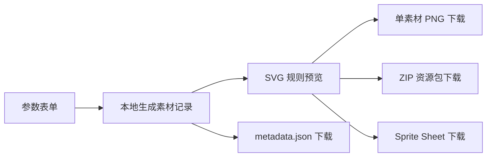

# 架构说明

## 文档状态

本文档描述包含本地导出扩展及 PR9 前端模块边界重构后的架构。产品需求以 `SPEC.md` v1.0 为准；后续 AI/Agent 路线属于规划，不表示当前实现。

## 技术结构

| 模块 | 技术 | 当前职责 |
| --- | --- | --- |
| `apps/web` | React + TypeScript + Vite | 参数表单、本地规则 SVG 预览、PNG、`metadata.json`、ZIP 与 Sprite Sheet 下载 |
| `apps/api` | Python + FastAPI | 提供 `GET /health` 健康检查接口 |
| `packages/renderer` | 预留 | 当前未承载实现，渲染逻辑位于前端 |
| `packages/schema` | 预留 | 当前未拆分为公共包 |
| `examples` | 预留 | 当前未提供静态示例资产 |

## 当前前端流程



1. 用户选择主题、风格、素材类型、尺寸和数量。
2. 前端根据参数生成含 `id`、`type`、`theme`、`style`、`size`、`seed` 的素材列表。
3. SVG 组件根据素材类型、主题色板与风格规则绘制卡片预览。
4. 单素材 PNG 下载将当前 SVG 栅格化为所选尺寸的 PNG。
5. Metadata 下载将本次请求和素材列表导出为 JSON。
6. ZIP 下载复用 PNG 栅格化结果，打包全部素材与 `metadata.json`。
7. Sprite Sheet 下载按页面素材顺序将预览合成为网格 PNG。

## 前端模块分层

```text
apps/web/src/
  components/
    AssetCard.tsx
    AssetPreview.tsx
  features/
    asset-generator/
      assetOptions.ts
      generateAssets.ts
  exporters/
    exportPng.ts
    exportMetadata.ts
    exportZip.ts
    exportSpriteSheet.ts
  types/
    asset.ts
  App.tsx
  main.tsx
  index.css
```

| 层级 | 当前职责 |
| --- | --- |
| `types/asset.ts` | 表单、素材记录和 metadata 的共享类型契约 |
| `features/asset-generator/` | 参数选项与确定性本地素材记录生成 |
| `components/` | SVG 规则预览和素材卡片交互 |
| `exporters/` | PNG、metadata、ZIP 与 Sprite Sheet 本地导出 |
| `App.tsx` | 表单与导出动作编排，不承载渲染或文件构造细节 |

## 运行边界

- MVP 核心功能在浏览器前端本地完成，不向后端发送生成请求。
- 后端目前仅用于健康检查，不承担素材生成、文件存储或鉴权。
- 当前没有数据库、登录、云部署或第三方图像生成服务依赖。

## 后续规划边界

未来可增加 LLM Planner、Structured Output、Function Calling、LangChain 与 MCP，以自然语言规划结构化 `AssetSpec` 并复用本地渲染能力。

当前未实现上述 AI/Agent 能力，也未实现批量 PNG 单独下载。
