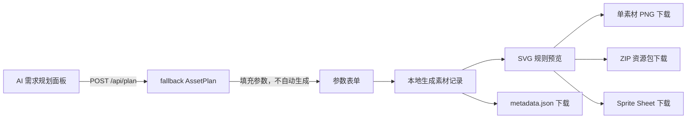
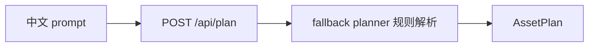

# 架构说明

## 文档状态

本文档描述包含本地导出扩展、前端模块边界重构、fallback planner API 与 PR11 前端规划面板后的架构。产品需求以 `SPEC.md` v1.0 为准；真实 LLM/Agent 路线属于规划，不表示当前实现。

## 技术结构

| 模块 | 技术 | 当前职责 |
| --- | --- | --- |
| `apps/web` | React + TypeScript + Vite | AI 需求规划面板、参数表单、本地规则 SVG 预览及全部本地导出 |
| `apps/api` | Python + FastAPI + Pydantic | 提供 `GET /health` 与规则解析 `POST /api/plan` |
| `packages/renderer` | 预留 | 当前未承载实现，渲染逻辑位于前端 |
| `packages/schema` | 预留 | 当前未拆分为公共包 |
| `examples` | 预留 | 当前未提供静态示例资产 |

## 当前前端流程



1. 用户可以输入中文需求，由前端调用后端 fallback planner 获得 `AssetPlan` 并填入参数表单。
2. 用户也可以跳过规划或在规划后继续手动修改主题、风格、素材类型、尺寸和数量。
3. 用户手动点击生成后，前端根据参数生成含 `id`、`type`、`theme`、`style`、`size`、`seed` 的素材列表。
4. SVG 组件根据素材类型、主题色板与风格规则绘制卡片预览。
5. 单素材 PNG 下载将当前 SVG 栅格化为所选尺寸的 PNG。
6. Metadata 下载将本次请求和素材列表导出为 JSON。
7. ZIP 下载复用 PNG 栅格化结果，打包全部素材与 `metadata.json`。
8. Sprite Sheet 下载按页面素材顺序将预览合成为网格 PNG。

## 前端模块分层

```text
apps/web/src/
  api/
    plannerApi.ts
  components/
    AssetCard.tsx
    AssetPreview.tsx
    PlannerPanel.tsx
  features/
    asset-generator/
      assetOptions.ts
      generateAssets.ts
  exporters/
    exportPng.ts
    exportMetadata.ts
    exportZip.ts
    exportSpriteSheet.ts
  types/
    asset.ts
  App.tsx
  main.tsx
  index.css
```

| 层级 | 当前职责 |
| --- | --- |
| `types/asset.ts` | 表单、计划、素材记录和 metadata 的共享类型契约 |
| `api/plannerApi.ts` | 调用 fallback planner API 并校验未知响应数据 |
| `features/asset-generator/` | 参数选项与确定性本地素材记录生成 |
| `components/` | 规划输入面板、SVG 规则预览和素材卡片交互 |
| `exporters/` | PNG、metadata、ZIP 与 Sprite Sheet 本地导出 |
| `App.tsx` | 表单与导出动作编排，不承载渲染或文件构造细节 |

## 后端模块分层

```text
apps/api/app/
  core/
    config.py             # 本地开发 CORS 配置
  schemas/
    planner.py            # PlanRequest、AssetPlan、PlanResponse
  planner/
    fallback_planner.py   # 不依赖模型的规则解析
  routes/
    health.py             # GET /health
    planner.py            # POST /api/plan
  main.py                 # FastAPI 应用装配
```



Fallback planner 是可运行的结构化规划入口，用于无 API Key 时演示规划契约；当前前端规划面板调用该接口填充表单，但不自动触发素材生成。

## 运行边界

- 素材生成与导出仍在浏览器前端本地完成，不向后端发送生成请求。
- 仅 AI 需求规划面板向后端发送中文需求；后端不可用时，手动参数流程仍可使用。
- 后端提供健康检查与 fallback planner API，不承担素材绘制、文件存储或鉴权。
- `POST /api/plan` 仅通过固定规则产出 `AssetPlan`，不调用 LLM 或外部服务。
- 当前没有数据库、登录、云部署或第三方图像生成服务依赖。

## 后续规划边界

未来可在现有 `AssetPlan` 契约上增加真实 LLM Planner、Structured Output、Function Calling、LangChain 与 MCP，以更灵活地规划结构化素材规格并复用本地渲染能力。

当前已实现 fallback 规则规划 API，但未实现真实 LLM 或上述 Agent 能力，也未实现批量 PNG 单独下载。
